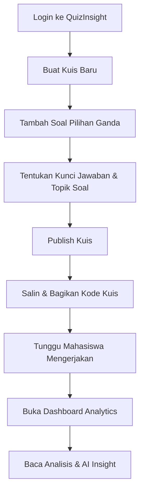
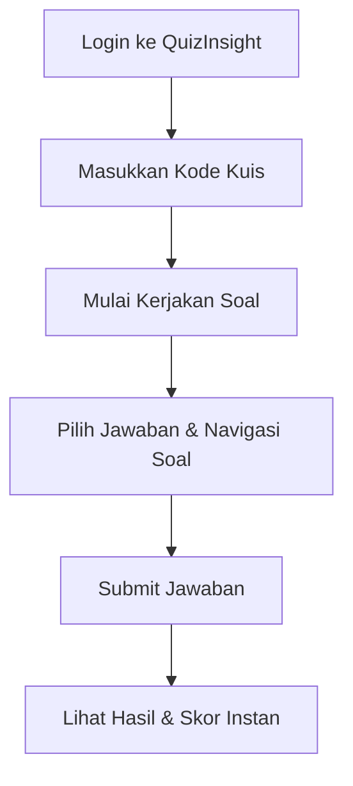
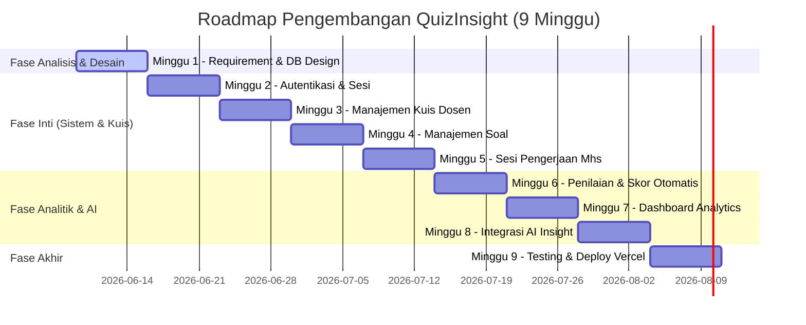

# Product Requirement Document (PRD)
## Nama Produk: QuizInsight

---

## 1. Product Vision
Membantu dosen mengevaluasi tingkat pemahaman mahasiswa secara cepat dan akurat melalui kuis berbasis topik serta analisis hasil belajar yang didukung oleh kecerdasan buatan (AI Insight).

---

## 2. Problem Statement
* **Kesulitan Evaluasi Cepat**: Dalam proses perkuliahan, dosen sering kali kesulitan untuk mengetahui secara langsung apakah mahasiswa benar-benar memahami materi yang telah diajarkan pada setiap sesi.
* **Keterlambatan Deteksi Masalah**: Metode evaluasi konvensional seperti UTS (Ujian Tengah Semester) dan UAS (Ujian Akhir Semester) sering kali terlambat untuk mendeteksi kesulitan belajar mahasiswa, sehingga dosen tidak sempat melakukan tindakan preventif atau perbaikan materi (remediasi).
* **Minimnya Insight Mendalam**: Aplikasi kuis standar umumnya hanya memberikan nilai akhir (skor angka) tanpa memberikan analisis per topik bahasan untuk mengetahui bagian materi mana yang belum dipahami oleh mayoritas mahasiswa.

---

## 3. Target User
### Primary User: Dosen
* **Kebutuhan**: Membuat kuis dengan cepat, mengelompokkan soal berdasarkan topik bahasan, memantau tingkat pemahaman kelas secara real-time, dan mendapatkan rekomendasi perbaikan dari AI.

### Secondary User: Mahasiswa
* **Kebutuhan**: Mengakses kuis dengan mudah menggunakan kode akses, mengerjakan soal, serta melihat hasil evaluasi beserta umpan balik instan mengenai kebenaran jawaban mereka.

---

## 4. Goals & Kriteria Keberhasilan
### Untuk Dosen
* **Kemudahan Pembuatan Kuis**: Dosen dapat menyusun kuis dan memasukkan bank soal dengan label topik dalam waktu kurang dari 5 menit.
* **Automasi Penilaian & Visualisasi**: Dashboard menampilkan visualisasi performa kelas secara instan setelah kuis ditutup.
* **Identifikasi Celah Pemahaman (Learning Gaps)**: Dosen mendapatkan insight otomatis mengenai topik mana yang memerlukan penjelasan ulang.

### Untuk Mahasiswa
* **Kemudahan Akses**: Mahasiswa dapat bergabung ke sesi kuis tanpa hambatan teknis yang rumit (cukup login dan masukkan kode).
* **Feedback Instan**: Mahasiswa langsung mengetahui hasil evaluasi setelah submit untuk memicu evaluasi mandiri.

---

## 5. Scope MVP (Minimum Viable Product)

### Fitur Utama Dosen (Lecturer Features)
1. **Authentication**:
   * Registrasi Akun Dosen.
   * Login & Logout.
2. **Quiz Management**:
   * Membuat kuis baru (Judul, Deskripsi, Batas Waktu/Status).
   * Mengedit detail kuis.
   * Menghapus kuis.
   * Mempublikasikan (*Publish*) kuis untuk menghasilkan kode kuis unik.
3. **Question Management**:
   * Menambahkan soal pilihan ganda (*multiple choice*).
   * Menentukan opsi jawaban dan menandai satu jawaban yang benar.
   * Menentukan topik/kategori spesifik untuk setiap butir soal (contoh: "Entropy", "Information Gain").
4. **Result Dashboard**:
   * Menampilkan total peserta yang telah mengerjakan kuis.
   * Menampilkan nilai rata-rata (*average score*), nilai tertinggi, dan nilai terendah kelas.
   * Grafik distribusi nilai mahasiswa.
   * Analisis performa per topik (persentase akurasi jawaban benar per topik).
5. **AI Insight**:
   * Ringkasan performa kuis secara keseluruhan.
   * Identifikasi topik dengan performa terbaik dan terendah.
   * Rekomendasi tindakan (misal: materi yang perlu diulas kembali).

### Fitur Utama Mahasiswa (Student Features)
1. **Authentication**:
   * Login & Logout (akun mahasiswa didaftarkan oleh sistem atau via registrasi dasar).
2. **Quiz Session**:
   * Memasukkan kode kuis unik untuk masuk ke sesi pengerjaan.
   * Mengikuti kuis dengan antarmuka yang bersih.
   * Menjawab soal pilihan ganda.
   * Mengirim (*Submit*) kuis sebelum waktu habis.
3. **Result View**:
   * Melihat skor/nilai instan setelah submit.
   * Melihat detail jumlah jawaban yang benar dan salah.

---

## 6. Out of Scope (Non-MVP)
Untuk menjaga fokus pengembangan agar tetap realistis dan selesai tepat waktu, fitur-fitur berikut **tidak** dimasukkan ke dalam fase MVP:
* ❌ Chatbot AI interaktif untuk tanya jawab materi.
* ❌ AI pembuat soal otomatis (*Auto-generate questions*).
* ❌ Evaluasi jawaban esai otomatis (*AI Essay grading*).
* ❌ Voice AI / Video AI proctoring (pengawasan ujian).
* ❌ Pembuatan & pengiriman sertifikat digital.
* ❌ Fitur gamifikasi (leaderboard publik, lencana/badges).
* ❌ Kuis langsung real-time (seperti Kahoot/Quizizz live mode).
* ❌ Integrasi langsung dengan LMS pihak ketiga (Moodle, Canvas, Google Classroom).
* ❌ Aplikasi mobile native (iOS/Android) — fokus utama pada Web Responsive.

---

## 7. User Flow

### A. User Flow Dosen


### B. User Flow Mahasiswa


---

## 8. Struktur Data Kuis & Soal
Setiap kuis terdiri dari beberapa soal, di mana masing-masing soal memiliki informasi topik spesifik untuk memetakan pemahaman mahasiswa.

### Contoh Kasus:
* **Kuis**: `Kuis Pertemuan 5 - Machine Learning Dasar`
* **Soal 1**: "Apa fungsi Entropy dalam algoritma Decision Tree?"
  * **Topik**: `Entropy`
  * **Pilihan Jawaban**:
    * A. Mengukur tingkat ketidakpastian data (Benar)
    * B. Menghitung jumlah cabang pohon
    * C. Mengukur efisiensi komputasi
    * D. Menentukan kedalaman pohon
* **Soal 2**: "Bagaimana rumus perhitungan Information Gain?"
  * **Topik**: `Information Gain`
  * **Pilihan Jawaban**:
    * A. Entropy Sebelum - Entropy Sesudah (Benar)
    * B. Entropy Sesudah / Entropy Sebelum
    * C. Logaritma basis 2 dari Entropy
    * D. Sum of Square Errors

> [!IMPORTANT]
> Setiap butir soal wajib memiliki minimal 4 opsi jawaban, 1 penanda jawaban benar, dan 1 label topik (string) yang spesifik untuk keperluan analisis data oleh AI.

---

## 9. Alur Analitik AI (AI Analytics Engine)
AI akan berfungsi sebagai analis data pintar yang membaca data mentah hasil kuis dan merumuskannya menjadi insight naratif yang mudah dipahami dosen.

### Input Data ke Model AI
Sistem akan mengirimkan payload JSON berikut ke API AI:
```json
{
  "total_students": 32,
  "average_score": 71.5,
  "topic_accuracy": [
    { "topic": "Entropy", "accuracy": 45.0 },
    { "topic": "Information Gain", "accuracy": 82.0 },
    { "topic": "Decision Tree", "accuracy": 76.0 }
  ],
  "frequent_mistakes": [
    {
      "question_id": "q-101",
      "question_text": "Apa fungsi Entropy dalam algoritma Decision Tree?",
      "correct_topic": "Entropy",
      "incorrect_percentage": 55.0
    }
  ]
}
```

### Contoh Output AI (Narasi Insight)
> "Berdasarkan hasil kuis, mahasiswa menunjukkan tingkat pemahaman yang sangat baik pada topik **Information Gain** dengan tingkat keberhasilan mencapai **82%**. Namun, pemahaman pada topik **Entropy** tergolong masih rendah yaitu hanya sebesar **45%**. Sebagian besar kesalahan mahasiswa terkonsentrasi pada soal nomor 1 yang menguji konsep dasar definisi Entropy. Direkomendasikan bagi dosen untuk mengulas kembali konsep dasar Entropy dan memberikan latihan visualisasi ketidakpastian data sebelum melanjutkan ke materi Random Forest."

---

## 10. Desain Database (Relational Schema)
Berikut adalah rancangan skema database relasional yang diimplementasikan menggunakan ORM Prisma.

```prisma
datasource db {
  provider = "postgresql"
  url      = env("DATABASE_URL")
}

generator client {
  provider = "prisma-client-js"
}

enum Role {
  LECTURER
  STUDENT
}

model User {
  id        String   @id @default(uuid())
  name      String
  email     String   @unique
  password  String
  role      Role
  quizzes   Quiz[]   @relation("QuizCreator")
  attempts  Attempt[]
  createdAt DateTime @default(now())
}

model Quiz {
  id          String     @id @default(uuid())
  title       String
  description String?
  code        String     @unique // Kode kuis unik untuk di-share ke mahasiswa
  creatorId   String
  creator     User       @relation("QuizCreator", fields: [creatorId], references: [id], onDelete: Cascade)
  createdAt   DateTime   @default(now())
  questions   Question[]
  attempts    Attempt[]
}

model Question {
  id           String   @id @default(uuid())
  quizId       String
  quiz         Quiz     @relation(fields: [quizId], references: [id], onDelete: Cascade)
  questionText String
  topic        String   // Label topik untuk analisis AI (contoh: "Entropy")
  options      Option[]
  answers      Answer[]
}

model Option {
  id         String   @id @default(uuid())
  questionId String
  question   Question @relation(fields: [questionId], references: [id], onDelete: Cascade)
  optionText String
  isCorrect  Boolean  @default(false)
  answers    Answer[]
}

model Attempt {
  id          String   @id @default(uuid())
  quizId      String
  quiz         Quiz     @relation(fields: [quizId], references: [id], onDelete: Cascade)
  studentId   String
  student     User     @relation(fields: [studentId], references: [id], onDelete: Cascade)
  score       Float
  submittedAt DateTime @default(now())
  answers     Answer[]
}

model Answer {
  id               String   @id @default(uuid())
  attemptId        String
  attempt          Attempt  @relation(fields: [attemptId], references: [id], onDelete: Cascade)
  questionId       String
  question         Question @relation(fields: [questionId], references: [id])
  selectedOptionId String
  selectedOption   Option   @relation(fields: [selectedOptionId], references: [id])
  isCorrect        Boolean
}
```

---

## 11. Spesifikasi Tampilan Dashboard (Dosen)

### A. Ringkasan Performa (Summary Cards)
* **Total Peserta**: `35 Mahasiswa`
* **Rata-rata Nilai**: `74.3 / 100`
* **Nilai Tertinggi**: `100`
* **Nilai Terendah**: `40`

### B. Tabel Analisis Topik (Topic Accuracy Table)
| Nama Topik | Tingkat Akurasi | Status Pemahaman |
| :--- | :---: | :---: |
| Information Gain | 82% | Baik (Tinggi) |
| Decision Tree | 76% | Cukup (Sedang) |
| Entropy | 45% | Kurang (Rendah) |

### C. Panel AI Insight (AI Summary Widget)
* Menampilkan text box dinamis berisi analisis naratif yang dihasilkan langsung oleh integrasi model AI (OpenAI API / IBM Granite).

---

## 12. Teknologi Stack (Recommended Stack)

| Komponen | Teknologi | Alasan Pemilihan |
| :--- | :--- | :--- |
| **Frontend** | Next.js (React) | Rendering cepat (SSR/ISR), SEO-friendly, struktur folder App Router yang terorganisasi. |
| **Backend** | Next.js API Routes | Menyederhanakan arsitektur (Fullstack dalam satu codebase), aman untuk eksekusi logika server. |
| **Database** | PostgreSQL (Supabase) | Database relasional yang solid, aman, dan performa tinggi untuk relasi data kuis. |
| **ORM** | Prisma | Mempermudah migrasi database dan penulisan query dengan type-safety penuh. |
| **Authentication**| NextAuth.js / Auth.js | Keamanan autentikasi bawaan untuk menangani sesi Dosen dan Mahasiswa secara terpisah. |
| **AI Integration**| OpenAI API / IBM Granite | Menyediakan model bahasa besar (LLM) untuk generate analisis naratif secara terstruktur. |
| **Deployment** | Vercel | Integrasi CD/CI mulus dengan repository GitHub dan optimasi performa Next.js. |

---

## 13. Roadmap & Timeline Pengerjaan



* **Minggu 1**: Finalisasi Kebutuhan, Pembuatan Wireframe UI, Inisiasi Proyek, dan Setup Database.
* **Minggu 2**: Implementasi Autentikasi (NextAuth) untuk pemisahan Role Dosen dan Mahasiswa.
* **Minggu 3**: Implementasi CRUD Kuis & fitur pembuatan kode kuis unik.
* **Minggu 4**: Fitur penambahan soal beserta input topik bahasan per soal.
* **Minggu 5**: Antarmuka pengerjaan kuis untuk Mahasiswa beserta sistem pembatas waktu pengerjaan.
* **Minggu 6**: Kalkulasi skor otomatis dan penyimpanan riwayat pengerjaan (*Attempts*).
* **Minggu 7**: Pembuatan Dashboard Visualisasi (Chart.js / Recharts) untuk analisis kelas & topik bagi dosen.
* **Minggu 8**: Pembuatan API route untuk generate insight menggunakan OpenAI / IBM Granite API.
* **Minggu 9**: Uji coba menyeluruh (End-to-End Testing), penanganan bug, dan Deployment ke Vercel.

---

> [!NOTE]
> Proyek ini dirancang agar dapat diselesaikan secara mandiri oleh satu pengembang (Solo Developer) dalam kurun waktu 9 minggu dengan efisiensi tinggi menggunakan arsitektur monolitik modern Next.js.
